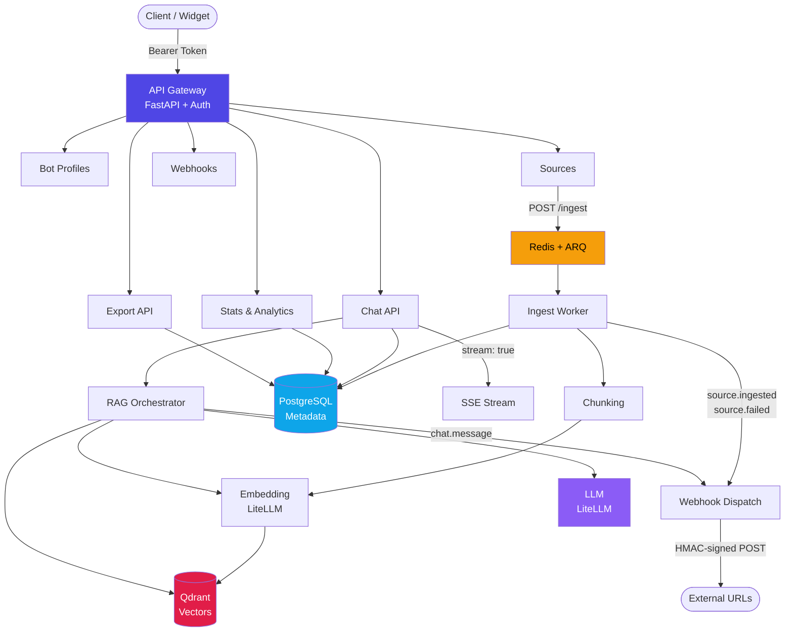

# MiniRAG

A modular, provider-agnostic Retrieval-Augmented Generation (RAG) platform with multi-tenancy. API-first design for building knowledge-powered chatbots.

## Architecture



## Key Features

- **Multi-tenant** — Strict data isolation with `tenant_id` on every entity
- **Provider-agnostic LLM** — Swap between OpenAI, Anthropic, Google via LiteLLM
- **Streaming chat (SSE)** — Real-time token streaming in API + widget
- **Scheduled auto-refresh** — URL sources re-ingested on configurable schedules (hourly/daily/weekly)
- **Webhooks** — HMAC-signed notifications for ingestion and chat events
- **Conversation export** — Bulk JSON/CSV export with date range and bot filtering
- **Feedback analytics** — Aggregate thumbs-up/down stats with per-bot breakdown and daily trends
- **Embeddable widget** — Shadow DOM chat widget, single script tag, streaming support
- **No-build dashboard** — Alpine.js + Tailwind CDN, served by FastAPI

## Tech Stack

| Layer | Technology |
|---|---|
| Web framework | FastAPI (async, Pydantic v2) |
| Metadata DB | PostgreSQL via SQLModel (async SQLAlchemy) |
| Vector DB | Qdrant |
| LLM abstraction | LiteLLM (OpenAI, Anthropic, Gemini interchangeable) |
| Task queue | Redis + ARQ |
| Auth | Argon2 passwords, SHA-256 API tokens, Fernet field encryption, JWT |
| Migrations | Alembic (async) |
| Containerization | Docker & Docker Compose |
| Reverse proxy | Caddy (auto-TLS) |
| Dashboard | HTML + Tailwind CSS (CDN) + Alpine.js + Chart.js — no build step |

## Dashboard

MiniRAG includes a built-in admin dashboard served directly by FastAPI at `/dashboard`. No build step required.

- **Overview** — Service health, summary stats, quick actions
- **Bot Profiles** — CRUD with inline "Try It" chat (with streaming)
- **Sources** — Manage knowledge sources, trigger ingestion, configure auto-refresh schedules
- **Chat History** — Browse conversations, export as JSON/CSV, submit feedback
- **Webhooks** — Create, test, and manage event notification endpoints
- **API Tokens** — Create/revoke tokens
- **Users** — Team management (owner/admin only)
- **Usage Analytics** — Token consumption charts, cost estimates, feedback analytics with per-bot breakdown
- **Settings** — Tenant info, system health

See [docs/admin-guide.md](docs/admin-guide.md) for a full walkthrough.

## Embeddable Chat Widget

Add a chat widget to any website with a single script tag. Supports real-time streaming:

```html
<script src="https://your-host/dashboard/widget/minirag-widget.js"
        data-bot-id="YOUR_BOT_PROFILE_ID"
        data-api-url="https://your-host"
        data-api-token="YOUR_API_TOKEN">
</script>
```

See [docs/widget-integration.md](docs/widget-integration.md) for configuration options and styling.

## Quick Start

### Prerequisites

- Python 3.11+
- Docker & Docker Compose (for infrastructure services)

### Local Development

```bash
# Clone and set up
git clone <repo-url> && cd mini-chat-rag
python -m venv .venv && source .venv/bin/activate
pip install -e ".[dev]"

# Configure environment
cp .env.example .env
# Edit .env with your settings (encryption keys, DB URLs, etc.)

# Start infrastructure
docker compose up -d postgres qdrant redis

# Run the API
uvicorn app.main:app --reload

# Run the worker (in a separate terminal)
python -m app.workers.main
```

### Run Tests

Tests use SQLite in-memory (no Docker needed):

```bash
pytest tests/ -v
```

### Database Migrations

```bash
# Run pending migrations (production)
docker compose exec web alembic upgrade head

# Check current migration status
docker compose exec web alembic current
```

## API Overview

### Bootstrap a Tenant

```bash
curl -X POST http://localhost:8000/v1/tenants \
  -H "Content-Type: application/json" \
  -d '{"tenant_name": "Acme Corp", "tenant_slug": "acme",
       "owner_email": "admin@acme.com", "owner_password": "supersecret123"}'
```

Returns a one-time API token. Use it for all subsequent requests:

```bash
export TOKEN="<raw_token from response>"
```

### Create a Bot Profile

```bash
curl -X POST http://localhost:8000/v1/bot-profiles \
  -H "Authorization: Bearer $TOKEN" \
  -H "Content-Type: application/json" \
  -d '{"name": "Support Bot", "system_prompt": "You help customers.",
       "model": "gpt-4o-mini"}'
```

### Add a Knowledge Source

```bash
curl -X POST http://localhost:8000/v1/sources \
  -H "Authorization: Bearer $TOKEN" \
  -H "Content-Type: application/json" \
  -d '{"bot_profile_id": "<profile_id>", "name": "FAQ",
       "source_type": "text", "content": "Your knowledge base text..."}'
```

### Ingest the Source

```bash
curl -X POST http://localhost:8000/v1/sources/<source_id>/ingest \
  -H "Authorization: Bearer $TOKEN"
```

### Chat

```bash
curl -X POST http://localhost:8000/v1/chat \
  -H "Authorization: Bearer $TOKEN" \
  -H "Content-Type: application/json" \
  -d '{"bot_profile_id": "<profile_id>", "message": "What is MiniRAG?"}'
```

### Chat with Streaming

```bash
curl -N -X POST http://localhost:8000/v1/chat \
  -H "Authorization: Bearer $TOKEN" \
  -H "Content-Type: application/json" \
  -d '{"bot_profile_id": "<profile_id>", "message": "What is MiniRAG?", "stream": true}'
```

## API Endpoints

### Auth & Tenants

| Method | Path | Auth | Description |
|---|---|---|---|
| `POST` | `/v1/tenants` | No | Bootstrap tenant + owner + API token |
| `GET` | `/v1/tenants/me` | Yes | Get current tenant info |
| `POST` | `/v1/auth/login` | No | Login with email + password, get JWT |
| `GET` | `/v1/auth/me` | Yes | Get current user + tenant |
| `POST` | `/v1/api-tokens` | Yes | Create new API token |
| `GET` | `/v1/api-tokens` | Yes | List API tokens |
| `DELETE` | `/v1/api-tokens/{id}` | Yes | Revoke token |

### Bot Profiles

| Method | Path | Auth | Description |
|---|---|---|---|
| `POST` | `/v1/bot-profiles` | Yes | Create bot profile |
| `GET` | `/v1/bot-profiles` | Yes | List bot profiles |
| `GET` | `/v1/bot-profiles/{id}` | Yes | Get bot profile |
| `PATCH` | `/v1/bot-profiles/{id}` | Yes | Update bot profile |
| `DELETE` | `/v1/bot-profiles/{id}` | Yes | Deactivate bot profile |

### Sources

| Method | Path | Auth | Description |
|---|---|---|---|
| `POST` | `/v1/sources` | Yes | Create source |
| `GET` | `/v1/sources` | Yes | List sources |
| `GET` | `/v1/sources/{id}` | Yes | Get source |
| `PATCH` | `/v1/sources/{id}` | Yes | Update source |
| `DELETE` | `/v1/sources/{id}` | Yes | Deactivate source |
| `POST` | `/v1/sources/{id}/ingest` | Yes | Trigger ingestion (202) |
| `POST` | `/v1/sources/upload` | Yes | Upload file source |
| `POST` | `/v1/sources/batch` | Yes | Batch create child sources |

### Chat

| Method | Path | Auth | Description |
|---|---|---|---|
| `GET` | `/v1/chat` | Yes | List chat sessions |
| `POST` | `/v1/chat` | Yes | Send message (supports `stream=true` for SSE) |
| `GET` | `/v1/chat/export` | Yes | Bulk export chats (JSON/CSV) |
| `GET` | `/v1/chat/{id}` | Yes | Get chat metadata |
| `GET` | `/v1/chat/{id}/messages` | Yes | Get chat history |
| `GET` | `/v1/chat/{id}/export` | Yes | Export single chat (JSON/CSV) |
| `PATCH` | `/v1/chat/{id}/messages/{mid}/feedback` | Yes | Submit message feedback |

### Webhooks

| Method | Path | Auth | Description |
|---|---|---|---|
| `POST` | `/v1/webhooks` | Yes | Create webhook |
| `GET` | `/v1/webhooks` | Yes | List webhooks |
| `GET` | `/v1/webhooks/{id}` | Yes | Get webhook |
| `DELETE` | `/v1/webhooks/{id}` | Yes | Delete webhook |
| `POST` | `/v1/webhooks/{id}/test` | Yes | Send test ping |

### Stats & Analytics

| Method | Path | Auth | Description |
|---|---|---|---|
| `GET` | `/v1/stats/overview` | Yes | Summary counts |
| `GET` | `/v1/stats/usage` | Yes | Token usage by day/model |
| `GET` | `/v1/stats/usage/by-bot` | Yes | Usage by bot profile |
| `GET` | `/v1/stats/usage/by-model` | Yes | Usage by model with costs |
| `GET` | `/v1/stats/cost-estimate` | Yes | Cost summary + projected spend |
| `GET` | `/v1/stats/pricing` | Yes | Model pricing table |
| `GET` | `/v1/stats/feedback` | Yes | Feedback analytics |
| `GET` | `/v1/stats/feedback/trend` | Yes | Daily feedback trend |

### System

| Method | Path | Auth | Description |
|---|---|---|---|
| `POST` | `/v1/users` | Yes | Create user (admin+) |
| `GET` | `/v1/users` | Yes | List users |
| `PATCH` | `/v1/users/{id}` | Yes | Update user (admin+) |
| `DELETE` | `/v1/users/{id}` | Yes | Deactivate user (admin+) |
| `GET` | `/v1/system/health` | Yes | Service connectivity check |

## Data Model

11 tables with strict tenant isolation (`tenant_id` on every entity):

- **Tenant** — Top-level organization boundary
- **User** — Belongs to tenant (owner/admin/member roles)
- **ApiToken** — Bearer tokens (SHA-256 hashed, shown once at creation)
- **BotProfile** — AI assistant config (model, prompt, Fernet-encrypted credentials)
- **Source** — Knowledge source (text/upload/url) with ingestion status and auto-refresh schedule
- **Document** — Raw content extracted from a source
- **Chunk** — Indexed text segment with Qdrant vector reference
- **Chat** — Conversation session with token counters
- **Message** — Single turn (user/assistant) with token usage and feedback
- **UsageEvent** — Per-request LLM token tracking (includes streaming metrics)
- **Webhook** — Event notification config (URL, HMAC secret, event subscriptions)

## Security

- API tokens stored as SHA-256 hashes (never plaintext)
- Passwords hashed with Argon2
- Provider API keys encrypted at rest with Fernet
- Webhook deliveries signed with HMAC-SHA256
- All queries automatically scoped by `tenant_id`
- Cross-tenant FK references validated before creation
- No secrets in code or logs; everything via `.env`

## Documentation

- [Installation & Maintenance](docs/installation.md)
- [Architecture (with Mermaid diagrams)](docs/architecture.md)
- [Admin Dashboard Guide](docs/admin-guide.md)
- [Widget Integration Guide](docs/widget-integration.md)

## Testing with Postman

A complete Postman collection is included at `postman/MiniRAG.postman_collection.json` with 28+ requests across 7 folders, each with automated test scripts.

### Import & Run

1. **Import**: Open Postman, click Import, and select `postman/MiniRAG.postman_collection.json`
2. **Run in order**: Execute the numbered folders sequentially (0-6) — test scripts auto-save IDs and tokens to collection variables

### Running with Newman (CLI)

```bash
# Install Newman
npm install -g newman

# Run the full collection
newman run postman/MiniRAG.postman_collection.json

# Run with a custom base URL
newman run postman/MiniRAG.postman_collection.json --env-var "base_url=https://mini-rag.de"
```

### Prerequisites for Full Run

- API running (`uvicorn app.main:app --reload`)
- For folders 0-4: only needs Postgres (infrastructure services)
- For folder 5 (Chat): also needs Redis + worker + Qdrant + a configured LLM provider
- Run folder 4's "Trigger Ingestion" and wait for source status to become `ready` before running folder 5

## Project Structure

```
app/
  main.py                  # FastAPI entrypoint + CORS + static serving
  core/
    config.py              # Settings from .env
    database.py            # Async engine + session factory
    security.py            # Encryption, hashing, JWT
    pricing.py             # Model pricing table + cost calculation
    cache.py               # In-memory TTL cache (30s, tenant-scoped)
  models/                  # SQLModel tables + Pydantic schemas
  api/
    deps.py                # Auth dependencies
    v1/
      auth.py              # Login + /me endpoints
      tenants.py           # Tenant bootstrap
      api_tokens.py        # Token CRUD
      bot_profiles.py      # Bot profile CRUD
      sources.py           # Source CRUD + ingest trigger + file upload
      chat.py              # Chat API + streaming + export
      webhooks.py          # Webhook CRUD + test ping
      users.py             # Users CRUD
      stats.py             # Usage statistics + feedback analytics
      system.py            # System health
  services/
    chunking.py            # Text normalization + splitting
    embedding.py           # LiteLLM embedding wrapper
    vector_store.py        # Qdrant operations
    orchestrator.py        # RAG pipeline + streaming
    webhook_dispatch.py    # HMAC-signed webhook delivery
    html_extract.py        # HTML-to-text extraction
  workers/
    main.py                # ARQ worker config + cron jobs
    ingest.py              # Ingestion task
    refresh.py             # Auto-refresh scheduler
alembic/
  env.py                   # Async migration runner
  versions/                # Migration scripts
dashboard/
  index.html               # SPA dashboard (Alpine.js + Tailwind)
  css/app.css              # Custom styles
  js/api.js                # API client with auth
  js/app.js                # Alpine.js stores + helpers
  widget/
    minirag-widget.js      # Embeddable chat widget (Shadow DOM + streaming)
    minirag-widget.css     # Widget styles
docs/
  architecture.md          # System architecture with Mermaid diagrams
  installation.md          # Setup & maintenance guide
  admin-guide.md           # Dashboard usage guide
  widget-integration.md    # Widget embedding guide
tests/                     # 129 async integration tests
postman/                   # Postman collection (28+ requests, auto-tests)
docker-compose.yml         # Postgres, Qdrant, Redis, web, worker, Caddy
Dockerfile                 # Multi-stage (web + worker targets)
```

## Blog Drafts

Build notes and development logs are in the [`drafts/`](drafts/) directory.

## License

See [LICENSE](LICENSE).
