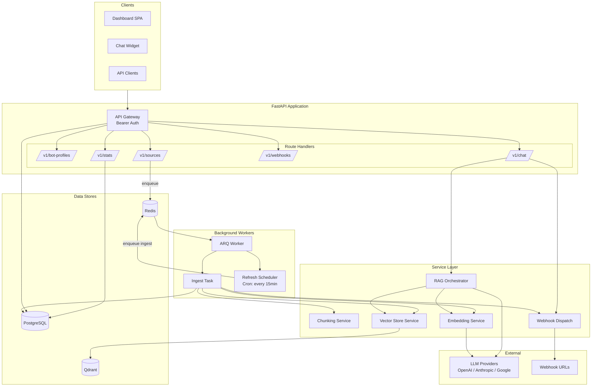
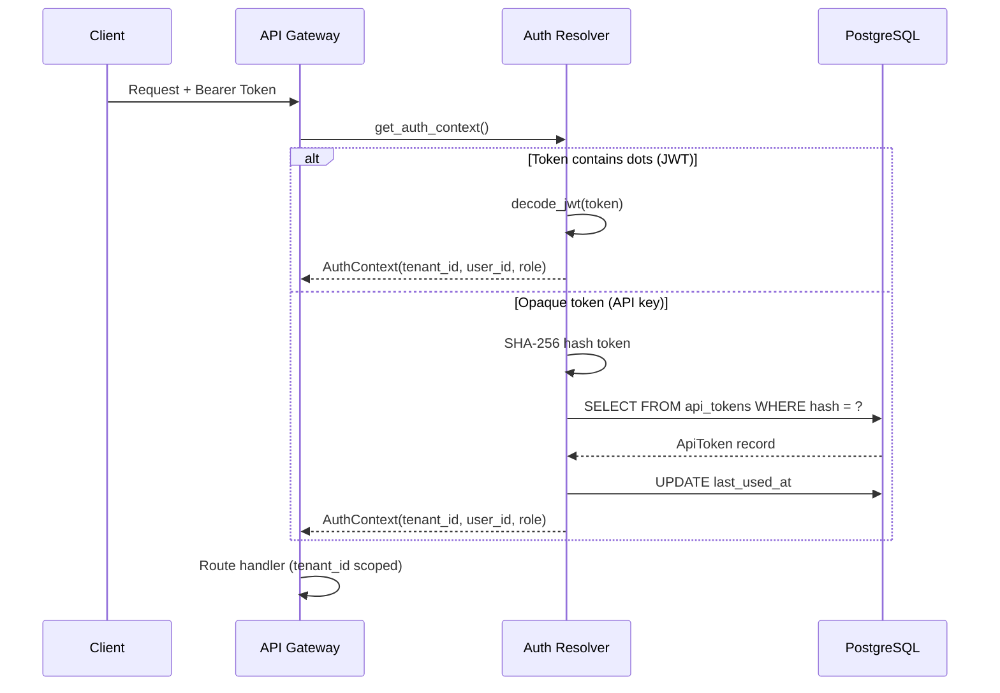
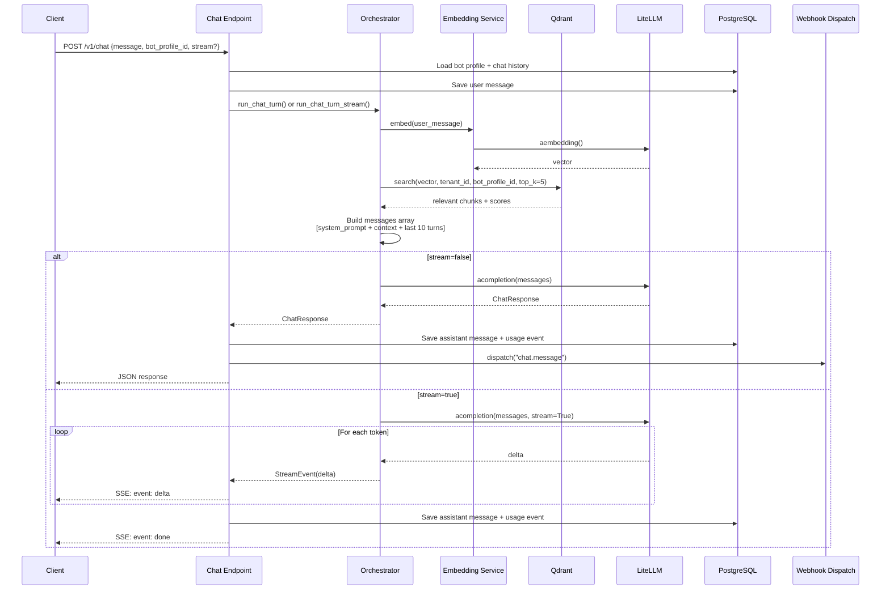
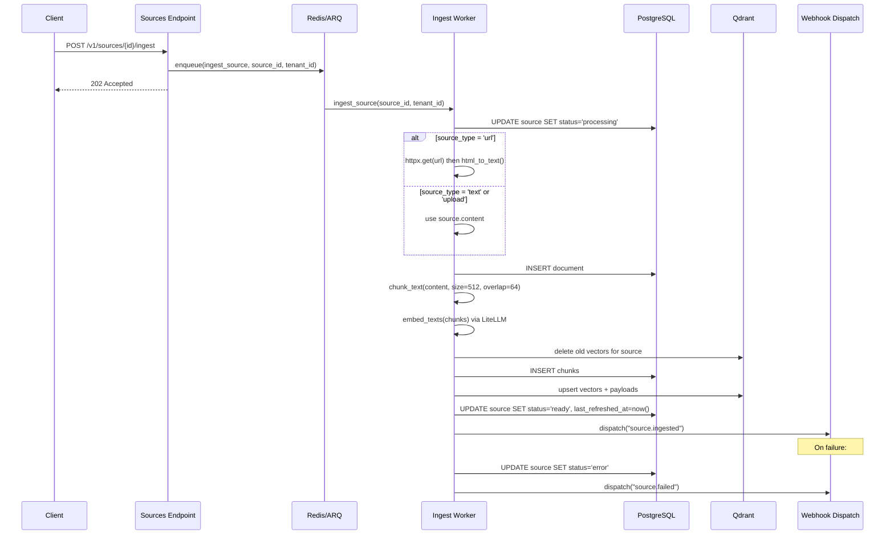
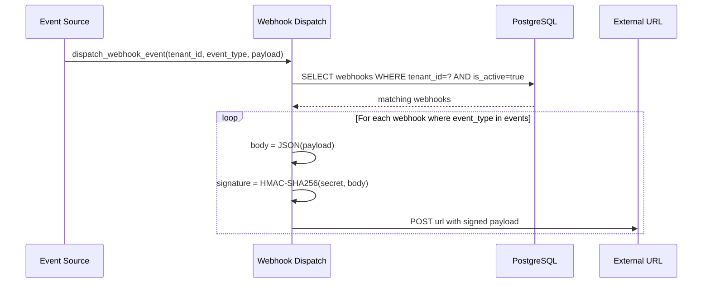
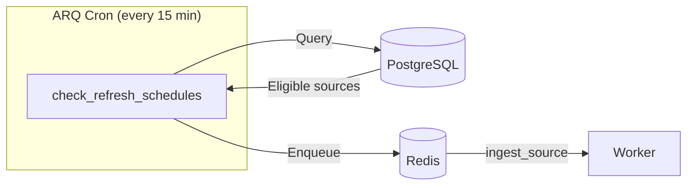
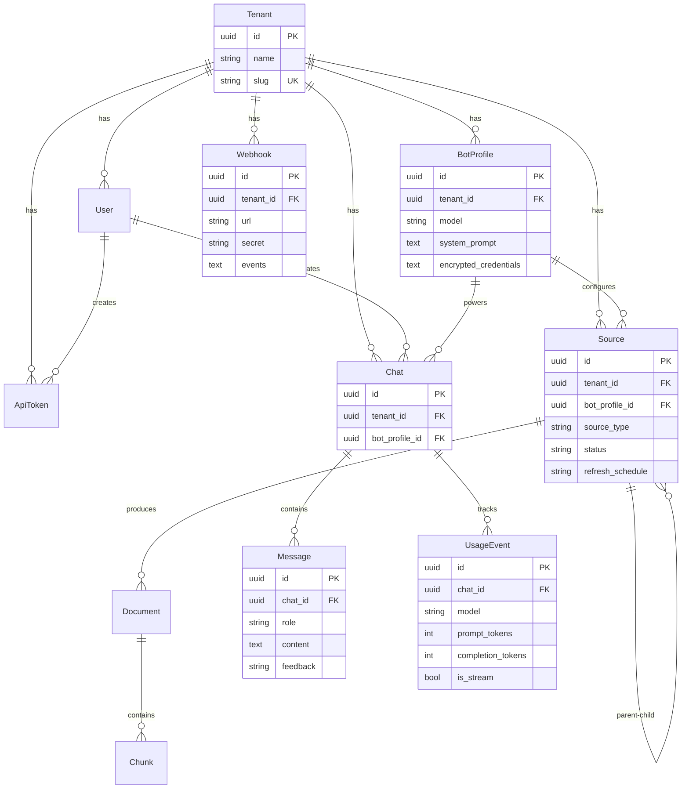

# Architecture

Comprehensive technical reference for the MiniRAG platform.

## System Overview



## Multi-Tenancy Model

MiniRAG enforces strict data isolation at the application layer. Every database table includes a `tenant_id` column, and every query filters by the authenticated tenant.

- **SQL Layer**: All queries include `WHERE tenant_id = ?` from `AuthContext`. Cross-tenant FK references are validated at creation time.
- **Vector Store**: Qdrant uses a single collection `minirag_chunks` with tenant isolation via payload filters on every search and delete.
- **Worker Layer**: Background jobs receive `tenant_id` as an explicit parameter and scope all queries accordingly.

## Request Authentication Flow



## Security Layers

MiniRAG implements defense-in-depth with four cryptographic layers:

| Layer | Algorithm | Purpose |
|---|---|---|
| **Passwords** | Argon2id | Memory-hard hashing, resistant to GPU/ASIC attacks |
| **API Tokens** | SHA-256 | Deterministic lookup on every request; 256-bit entropy makes brute-force infeasible |
| **Field Encryption** | Fernet (AES-128-CBC) | Encrypt LLM provider API keys at rest in `BotProfile.encrypted_credentials` |
| **Sessions** | JWT (HS256) | Stateless session tokens with `sub`, `tid`, `role`, `exp` claims |

## RAG Pipeline (Chat Request)



### Context Injection

The orchestrator injects retrieved chunks into the system prompt:

```
{system_prompt}

---
Relevant context from the knowledge base:
[1] {chunk_1_content}
[2] {chunk_2_content}
[3] {chunk_3_content}
---

Use the context above to answer the user's question.
```

## Streaming Protocol (SSE)

When `stream=true`, the response uses `Content-Type: text/event-stream` with three event types:

| Order | Event | Description |
|---|---|---|
| 1 | `sources` | Retrieved chunks with scores (sent before LLM starts) |
| 2 | `delta` | Token chunks as they arrive (repeated) |
| 3 | `done` | Final event with `chat_id`, `message_id`, and usage stats |

```
event: sources
data: {"sources": [{"chunk_id": "...", "content": "...", "score": 0.87}]}

event: delta
data: {"content": "Hello"}

event: delta
data: {"content": ", how can I help?"}

event: done
data: {"chat_id": "...", "message_id": "...", "usage": {"model": "gpt-4o-mini", "prompt_tokens": 1250, "completion_tokens": 340}}
```

Headers: `Cache-Control: no-cache`, `X-Accel-Buffering: no` (prevents proxy buffering).

Streaming metrics tracked in `UsageEvent`: `time_to_first_token_ms`, `stream_duration_ms`.

## Ingestion Pipeline



### Ingestion Steps

1. **Mark processing** — Update source status, clear error
2. **Extract content** — URL: HTTP GET + HTML-to-text; Text/Upload: use stored content
3. **Create document** — Store raw content with character count
4. **Chunk** — Recursive splitting (512 chars, 64 overlap) at semantic boundaries
5. **Embed** — Batch via LiteLLM `aembedding` (max 128 per batch)
6. **Cleanup** — Delete old Qdrant vectors for re-ingestion
7. **Persist** — Insert chunks to PostgreSQL, upsert vectors to Qdrant
8. **Finalize** — Update counters, set status to `ready`, set `last_refreshed_at`
9. **Notify** — Fire `source.ingested` webhook (or `source.failed` on error)

## Webhook Dispatch



### Supported Events

| Event Type | Source | Payload |
|---|---|---|
| `source.ingested` | Ingest worker | `source_id`, `source_name`, `document_count`, `chunk_count` |
| `source.failed` | Ingest worker | `source_id`, `error` |
| `chat.message` | Chat endpoint | `chat_id`, `message_id`, `bot_profile_id` |

### HMAC Verification

Every delivery includes `X-MiniRAG-Signature` (HMAC-SHA256 hex digest) and `X-MiniRAG-Event` headers.

**Verify in your endpoint:**

```python
import hmac, hashlib

def verify_webhook(body: bytes, signature: str, secret: str) -> bool:
    expected = hmac.new(secret.encode(), body, hashlib.sha256).hexdigest()
    return hmac.compare_digest(expected, signature)
```

Delivery timeout: 10s. Failures are logged but never block the triggering operation.

## Auto-Refresh Scheduling



**Schedules:** `hourly` (1h), `daily` (24h), `weekly` (7d), `none` (disabled).

**Eligibility:** Source must have `refresh_schedule != none`, `status != processing`, `is_active = true`, and `last_refreshed_at + interval < now()`.

## Caching Strategy

Stats endpoints use an in-memory TTL cache (`app/core/cache.py`):

- **TTL**: 30 seconds
- **Scope**: Process-local, tenant-scoped keys like `("stats", "overview", tenant_id)`
- **Why not Redis**: Avoids network round-trip for read-heavy analytics; 30s staleness is acceptable

## Data Model



### Enums

| Enum | Values |
|---|---|
| `UserRole` | `owner`, `admin`, `member` |
| `SourceType` | `text`, `upload`, `url` |
| `SourceStatus` | `pending`, `processing`, `ready`, `error` |
| `RefreshSchedule` | `none`, `hourly`, `daily`, `weekly` |
| `MessageRole` | `system`, `user`, `assistant` |
| `WebhookEvent` | `source.ingested`, `source.failed`, `chat.message` |

### Timestamp Convention

All tables include `created_at` and `updated_at` via `TimestampMixin`. Timestamps use `TIMESTAMP WITHOUT TIME ZONE` in UTC. Always use `utcnow()` from `app/models/base.py` — never `datetime.now(timezone.utc)` directly, as it breaks asyncpg.
